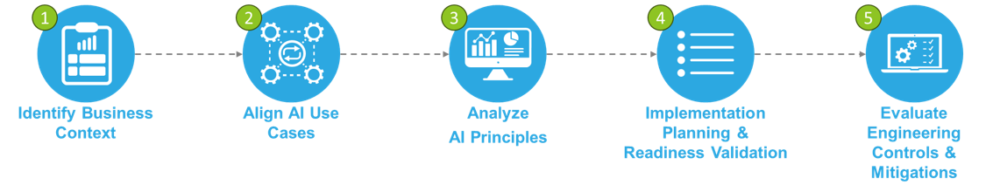
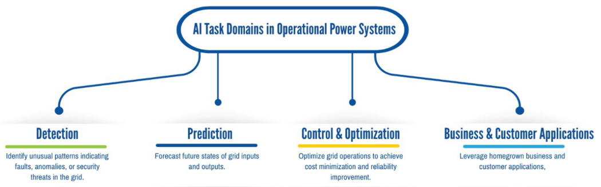
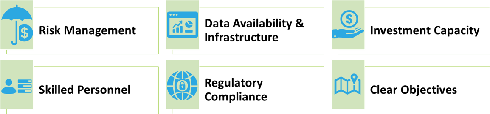

# Cognito

## Overview

**Cognito** is an AI Readiness Framework and decision-support application developed by **Idaho National Laboratory (INL)** to help electric utilities and grid operators evaluate the **benefits, risks, and consequences** of adopting artificial intelligence (AI) before committing to implementation.

Cognito is intentionally **not** an operational AI system. Instead, it provides a structured, evidence-based process that enables utilities to reason about AI adoption in the context of reliability, safety, cybersecurity, governance, workforce readiness, and regulatory obligations. The framework is tailored specifically for electric power transmission and distribution environments and reflects real-world utility constraints and consequence-driven decision-making.

---

## Why Cognito Exists

The electric grid is undergoing rapid digital transformation, with AI increasingly proposed for forecasting, anomaly detection, optimization, and decision support. While AI can deliver significant benefits, poorly aligned or prematurely deployed AI systems can introduce new operational, safety, and cybersecurity risks.

Cognito helps organizations answer a fundamental question:

> **Should we pursue this AI application, and if so, under what conditions?**

The framework ensures AI adoption decisions are grounded in **organizational readiness, consequence awareness, and system-level thinking**, rather than technology novelty or vendor pressure.

---

## The Cognito Five-Step Framework

### Framework at a Glance

The Cognito AI Readiness Framework is organized as a structured, consequence-driven
five-step process. Organizations may complete an initial critical assessment
or proceed through deeper readiness and implementation planning.

**Phase 1 – Critical Assessment:** Steps 1–3  
**Phase 2 – Deep Readiness & Implementation Planning:** Steps 4–5

Cognito is organized as a **five-step process**, with each step answering a specific decision-critical question for utilities:

### Step 1 – Identify Business Context

Assess current organizational capabilities across functions such as field operations, system operations, asset management, planning and engineering, and customer operations. Capabilities are rated on a maturity scale (1–5) and used to identify concrete AI-relevant opportunities.

**Key question:** *Where are we today, and what gaps or strengths define our AI readiness?*

---

### Step 2 – Align AI Use Cases

Match identified opportunities to specific AI use cases using the Cognito AI Use Case Catalog. Use cases are evaluated along two dimensions:

* **Consequence Profile:** Low, Moderate, High, or Highest
* **Technology Readiness:** Ready Now, Emerging, or Future State

This step ensures selected use cases align with organizational maturity and risk tolerance.

**Key question:** *What should we pursue first, and are the risks appropriate for our organization?*

AI use cases are further mapped to four foundational task domains commonly found
in operational power system applications:

---

### Step 3 – AI Principles Analysis

Cognito evaluates readiness across six AI Readiness Principles to determine whether
an organization has the foundational capabilities required to implement a selected AI use case.

Evaluate whether the organization possesses the foundational capabilities required to implement the selected AI use case. Cognito assesses readiness across **six AI principles**:

* Risk Management
* Data Availability & Infrastructure
* Investment Capacity
* Skilled Personnel
* Regulatory Compliance
* Clear Objectives

Step 3 is divided into two phases:

* **Phase 1 (Critical Assessment):** Focused consequence and risk evaluation
* **Phase 2 (Deep Readiness):** Full readiness analysis across all principles

**Key question:** *Do we actually have what it takes to implement this safely and effectively?*

---

### Step 4 – Implementation Planning & Readiness Validation

Translate readiness findings into a concrete implementation blueprint. This step produces:

* **AI Scenario Definition:** What the system will do, how it integrates with operations, required data flows, and success metrics
* **Build vs. Buy vs. Partner Decision:** A structured evaluation of implementation pathways

**Key question:** *What exactly are we building, and how will we implement it?*

---

### Step 5 – Engineering Controls & Mitigations

Identify safeguards required to deploy and sustain the AI system based on its consequence profile. Controls are organized across:

* Engineering Controls
* Operational Controls
* Governance Controls

**Key question:** *How do we ensure dependable and safe AI operation over time?*

---

## Two-Phase Assessment Structure

Cognito supports two natural stopping points:

### Phase 1 – Critical Assessment

Includes Steps 1–2 and the Risk Management portion of Step 3. Phase 1 is suitable for:

* Executive decision-making
* Go / no-go determinations
* Early risk identification

### Phase 2 – Deep Readiness & Implementation Planning

Includes remaining AI principles plus Steps 4–5. Phase 2 supports:

* Funding approval
* Vendor engagement
* Pilot-to-production transition

---

## What Cognito Is

* A **decision intelligence framework** for AI adoption in electric utilities
* A **structured readiness and consequence assessment process**
* A **documentation and governance aid** for critical infrastructure AI
* A **self-guided or facilitated assessment tool**, supported by workbook and web application

## What Cognito Is Not

* An autonomous AI system
* A real-time grid control platform
* A machine learning training environment
* A replacement for engineering judgment or regulatory oversight

---

## Intended Audience

Cognito is designed for:

* Investor-owned, municipal, and cooperative utilities
* Transmission operators, ISOs, and RTOs
* Utility engineers and operators
* AI governance, risk, and compliance teams
* Regulators, policymakers, and DOE collaborators

---

## Repository Purpose

This repository contains the **Cognito application**, supporting documentation, and implementation artifacts that digitize and operationalize the Cognito AI Readiness Framework.

---

## How to Read This Repository

This repository contains both **framework documentation** and an evolving
**application implementation**.

- `README.md` – High-level overview of the Cognito framework
- `docs/diagrams/` – Canonical framework visuals used across documentation and briefings
- `docs/framework/` – Detailed explanations of each framework step
- `worksheets/` – Structured prompts aligned to the Cognito workbook
- `app/` – Application source code (under active development)

Readers new to Cognito should start with the framework diagram above and then
review each step sequentially.

## How to Use This Repository

Typical usage patterns include:

* **Exploration:** Review documentation to understand the Cognito framework and methodology
* **Assessment:** Use the application or worksheets to conduct Phase 1 or Phase 2 evaluations
* **Planning:** Apply outputs to support AI governance, funding decisions, and implementation roadmaps
* **Facilitation:** Support workshops or cross-functional reviews using structured prompts

---

## Non-Goals and Out of Scope

To avoid misinterpretation, Cognito explicitly does **not**:

* Provide automated or real-time control of grid assets
* Replace operator judgment or existing protection systems
* Circumvent regulatory or compliance requirements
* Recommend AI deployment without readiness validation

---

## Funding Acknowledgment

This work was supported by the **U.S. Department of Energy (DOE)** through Idaho National Laboratory. Any opinions, findings, conclusions, or recommendations expressed in this repository are those of the authors and do not necessarily reflect the views of the DOE.

---

## Disclaimer

Cognito is intended for **analysis and decision-support purposes only**. It does not provide operational control, automated decision-making, or real-time AI execution affecting electric grid systems.

All conclusions and recommendations produced using Cognito should be reviewed by qualified personnel and evaluated within appropriate regulatory and operational contexts.

---

## License

License information will be provided in the `LICENSE` file.
